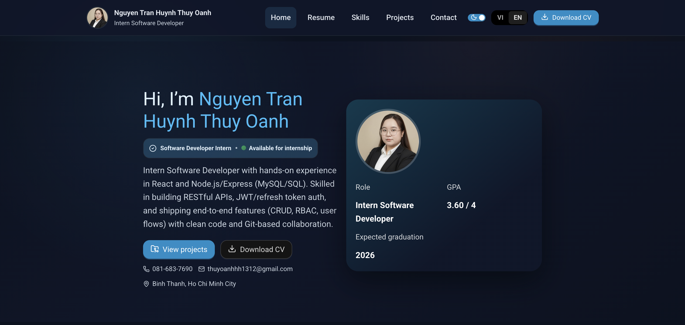
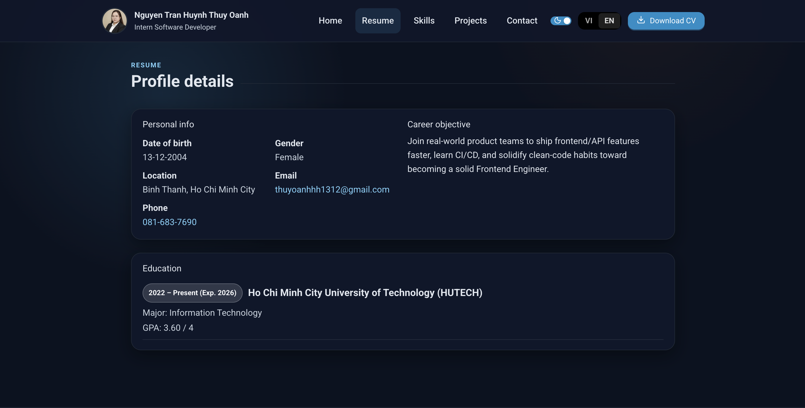
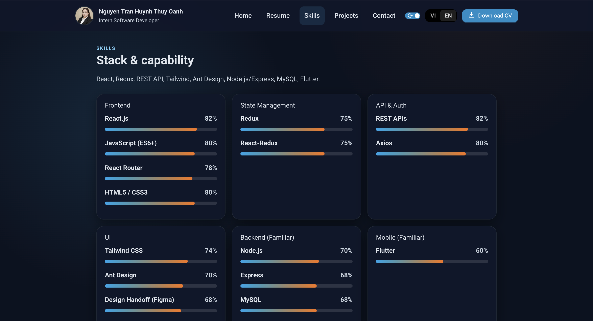
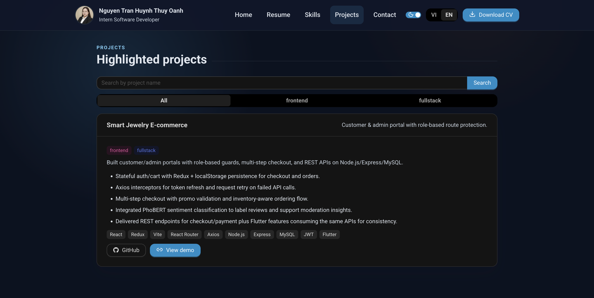

# Portfolio (CV Website) — Nguyen Tran Huynh Thuy Oanh

## Tech stack

- Vite 7 + React 18
- React Router v6, AnimatePresence (framer-motion) for route transitions
- Ant Design **v6.3.x** for form/button/card + message
- **Tailwind CSS 4.2 (v4)** with `@tailwindcss/vite`, plus light custom CSS (Roboto base font)
- clsx for classNames; no external state manager beyond React hooks
- Languages: VI/EN via context + AntD Segmented switcher

## How to run

```bash
npm install
npm run dev      # start dev server
npm run build    # production build
npm run preview  # preview the built app
```

## Implemented features

- 5 routes: `/` `resume` `skills` `projects` `contact` + 404 page
- Navbar active state, mobile hamburger (Enter/Space), ScrollToTop and Back-to-top button
- Route transitions (Framer Motion) for all pages and CTA
- CV content: personal info, objective, education, skills, projects from the provided PDFs
- Projects are data-driven, with tag filter + search (AntD Input.Search + Segmented); missing demo shows disabled state + tooltip
- Contact form with AntD Form + Input + Button + message: required fields, email format, message ≥ 20 chars, loading + mock success
- Tailwind v4 utilities for layout (container, grid, background) plus custom styling
- Responsive: mobile <768px, tablet 768–1024px, desktop >1024px
- Accessibility basics: semantic sections, labeled inputs, image alt text, focus outlines, keyboard-friendly menu

## Folder structure

- `src/pages`: Home, Resume, Skills, Projects, Contact, NotFound
- `src/components`: Layout, Header/Footer, PageTransition, BackToTop, SkillBar, ProjectCard, TagFilter, SectionTitle
- `src/data`: profile, skills, projects (sourced from CV)
- `public/CV_INTERN_NGUYENTRANHUYNHTHUYOANH.pdf`: original CV; `public/avatar.png`: avatar used on site

## Demo

Live: [https://thuyoanh-portfolio.netlify.app/](https://thuyoanh-portfolio.netlify.app/)

## Screenshots

Home (dark):


Resume (dark):


Skills (dark):


Projects (dark):


---
Contact: <thuyoanhhh1312@gmail.com> · Phone: 081-683-7690 · Binh Thanh, Ho Chi Minh City
